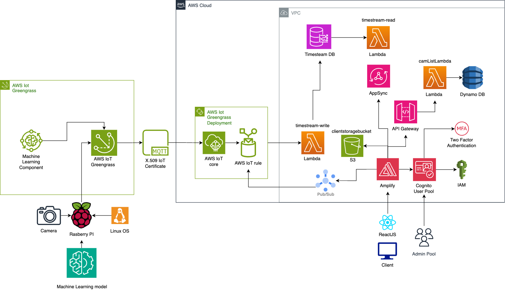

# Client Developer Guide

This project was bootstrapped with [Create React App](https://github.com/facebook/create-react-app).

## Table of Contents

- [Developer Guide] (#client-developer-guide)
- [Table of Contents] (#table-of-contents)
- [Requirements] (#requirements)
- [Development Considerations](#development-considerations)
  - [Local App Development](#local-app-development)
    - [Local React deployment](#local-react-deployment)
    - [Using Private AWS resources locally](#using-private-aws-resources-locally)
- [CDK](#cdk)
- [Architecture Diagram and Database Schema](#architecture-diagram-and-database-schema)
- [Miscellaneous Scripts](#miscellaneous-scripts)

## Requirements

To set up a development environment, you must have the following installed on your device:

- [git](https://git-scm.com/downloads)
- [Python 3+](https://www.python.org/downloads/)
- [AWS Account](https://aws.amazon.com/account/)
- [AWS Amplify] (https://docs.amplify.aws/javascript/tools/cli/start/set-up-cli/)
- [GitHub Account](https://github.com/)
- [Node JS] (https://nodejs.org/en/download)
- [npm] (https://docs.npmjs.com/cli/v8/commands/npm-install/)
- [yarn] (https://classic.yarnpkg.com/lang/en/docs/install/)

If you are on a Windows device, it is recommended to install the [Windows Subsystem For Linux](https://docs.microsoft.com/en-us/windows/wsl/install), which lets you run a Linux terminal on your Windows computer natively. Some of the steps will require its use. [Windows Terminal](https://apps.microsoft.com/store/detail/windows-terminal/9N0DX20HK701) is also recommended for using WSL. Further, it is recommended to install and make use of [Git Bash](https://git-scm.com/downloads).

## [Development Considerations]

This section includes some additional aspects that developers can consider using in the developement process.

1. **AWS Toolkit**: The [AWS Toolkit] (https://aws.amazon.com/visualstudiocode/) extension for VS Code can be used to access AWS services and the CDK with ease directly from VS code through the extension.

## Local App Development

The package manager used for this app is **yarn**, under version 1.22.19, and can be installed using npm. The react version used in this app is 18.2.0 and the node version used in this app is 20.1.0. Ensure that your node and yarn version match these. You may refer to the package.json file to understand the project dependencies better.

To develop the React App locally, these steps must be followed first.

### Local React Development

1. Clone the git repo
2. Create a .env file and fill in the following information
   ```
   AWS_PROFILE_NAME=<insert AWS SSO profile name>
   MODE=dev
   ```
3. Enter the directory `/room-occupancy/client`, and then run `yarn install`, to install all the required dependencies for the client. To learn more about what dependencies are used in the client, refer to the `package.json` file.
4. To run the client under the development environment, execute the following command `yarn start`.
5. Ensure your AWS profile is authenticated. Follow steps in the management console to authenticate your profile.
6. After your AWS profile is authenticated, run the command `amplify pull`, to pull the amplify environment from the cloud to your development environment. Now check to ensure that there is a file called `aws-exports.js` in the /src directory.
7. To ensure that there is no discrepancy between the local and CI/CD environments, run `amplify env checkout staging`.

**Note: To view a list of available scripts, refer to the scripts section below.**

### Using Private AWS resources locally

## Architecture Diagram and Database Schema



## Available Scripts

In the client directory, you can run:

### `yarn start`

Runs the app in the development mode.\
Open [http://localhost:3000](http://localhost:3000) to view it in the browser.

The page will reload if you make edits.\
You will also see any lint errors in the console.

### `yarn test`

Launches the test runner.\
See the section about [running tests](https://facebook.github.io/create-react-app/docs/running-tests) for more information.
Test cases are written using Jest and React Testing Library on the client side.

### `yarn testAll`

Launches the test runner using the interactive watch mode.\
Test cases are written using Jest and React Testing Library on the client side.

### `yarn testReport`

Launches the test runner.\
This will also create a JSON file in "./docs/test-report/testOutput.json that contains information on the tests.
Additionally, an HTML page will be created to display the test results in user friendly manner

### `yarn build`

Builds the app for production to the `build` folder.\
It correctly bundles React in production mode and optimizes the build for the best performance.

The build is minified and the filenames include the hashes.\
Your app is ready to be deployed!

See the section about [deployment](https://facebook.github.io/create-react-app/docs/deployment) for more information.

### `yarn eject`

**Note: this is a one-way operation. Once you `eject`, you can’t go back!**

If you aren’t satisfied with the build tool and configuration choices, you can `eject` at any time. This command will remove the single build dependency from your project.

Instead, it will copy all the configuration files and the transitive dependencies (webpack, Babel, ESLint, etc) right into your project so you have full control over them. All of the commands except `eject` will still work, but they will point to the copied scripts so you can tweak them. At this point you’re on your own.

You don’t have to ever use `eject`. The curated feature set is suitable for small and middle deployments, and you shouldn’t feel obligated to use this feature. However we understand that this tool wouldn’t be useful if you couldn’t customize it when you are ready for it.
