# User Guide Documentation

There are two views in the app - the user view and the administrator view. To login as an administrator, you will need credentials setup with AWS Cognito through AWS Amplify.

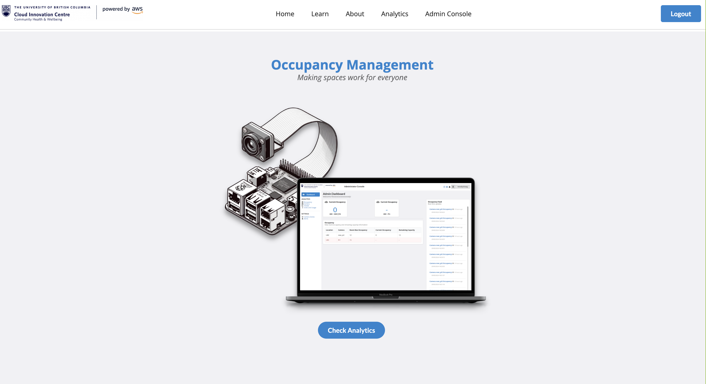

# Analytics & Trends

The analytics and trends page is accessible by both users and administrators. It provides access to occupancy information from the cameras. The page features an occupancy feed and alerts table. The occupancy feed is near real-time. The alerts table shows the current occupancy and the remaining capacity in a room, based maximum occupancy settings defined by an adminstrator.

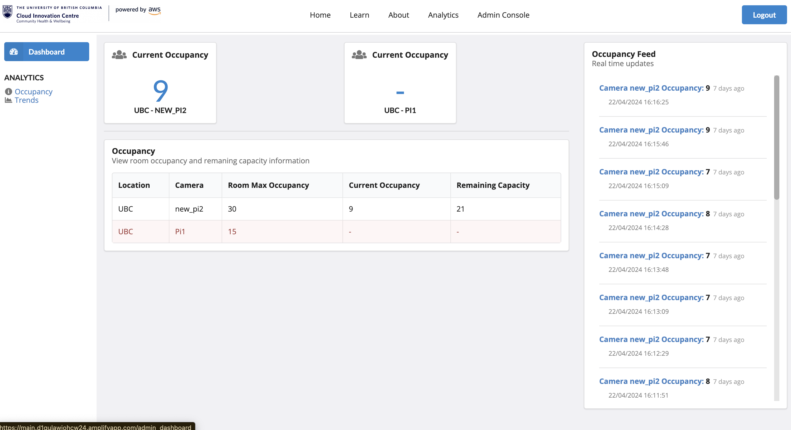

The trends page allows users to view occupancy data for the past 90 days. To use this page, click on the dropdown, select a camera and click the **_Submit_** button.

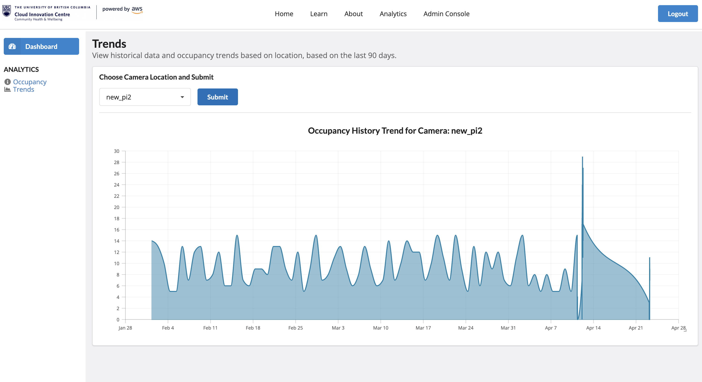

# Log In / Sign Up Flow

## First time sign up

1\. Admin will provide username and password credential for first time setup.
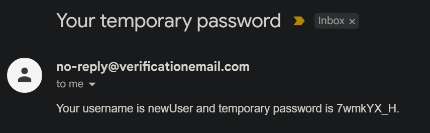

2\. After entering the username and password, you will be prompt to change your password and your username.
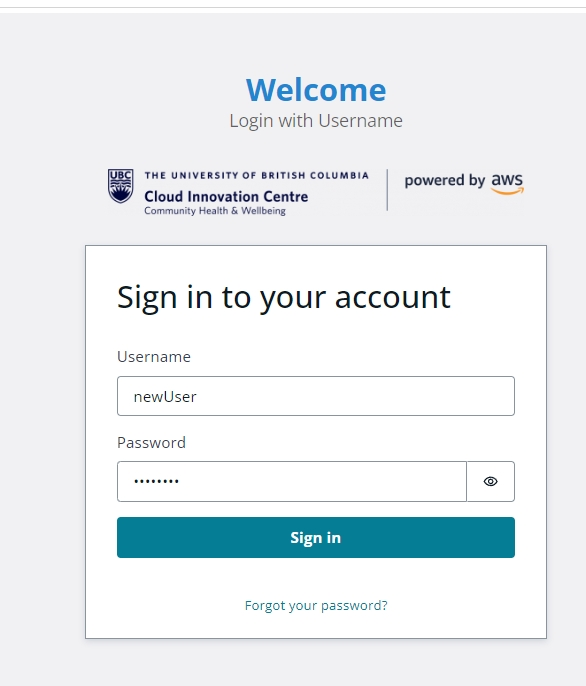
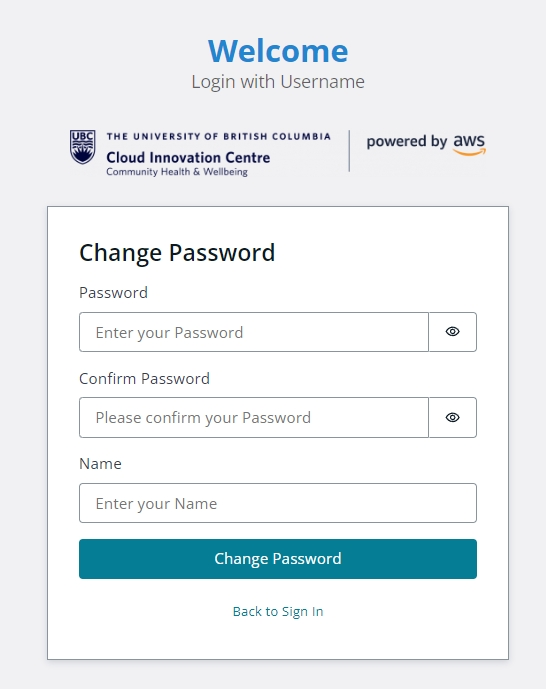

3\. Use any two step verification app(e.g. DUO, Google Authenticator) to scan the qr code provided or manually enter the code below.
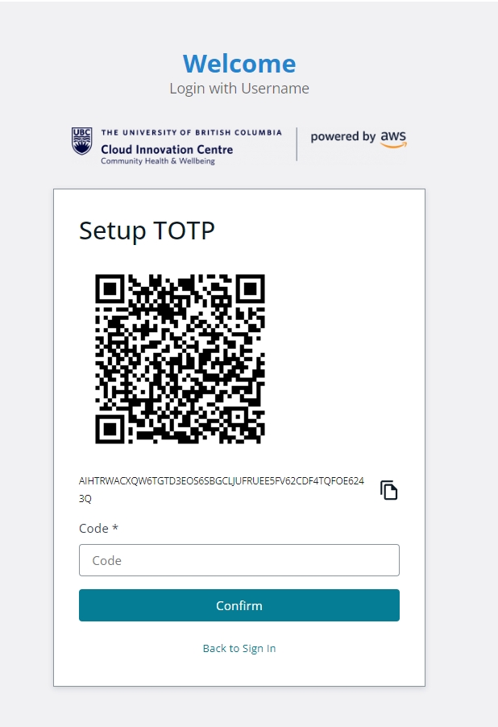

## Login

In login page, enter your username and password and click **_Sign In_**, you will be prompt for a TOTP code, go to the 2SV app and enter the provided code.

# Administrator View

## Admin Dashboard

The admin dashboard looks similar to the occupancy page. Though, the sidebar and navigation allows the admin to access other features such as Costs Page, Camera Settings, etc.

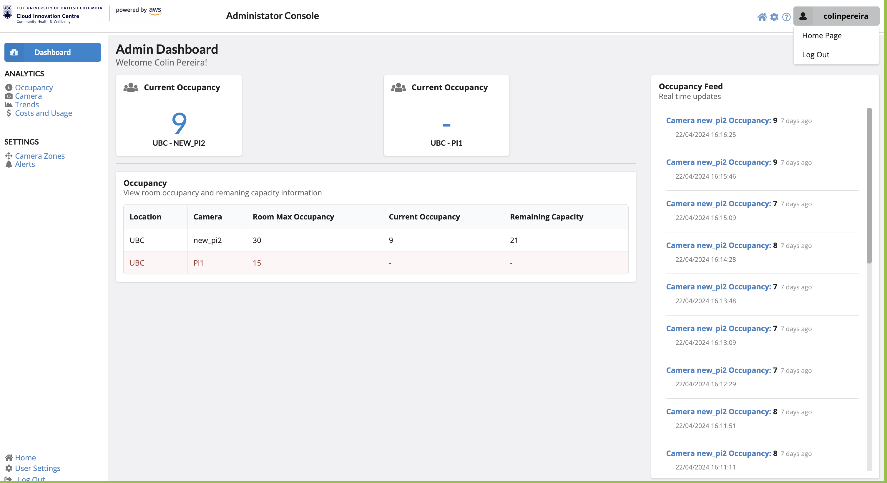

## Camera Page

The camera page displays all cameras setup on AWS Greengrass. It shows various information about the cameras, along with the camera's greengrass status as provided by the AWS Greengrass API.

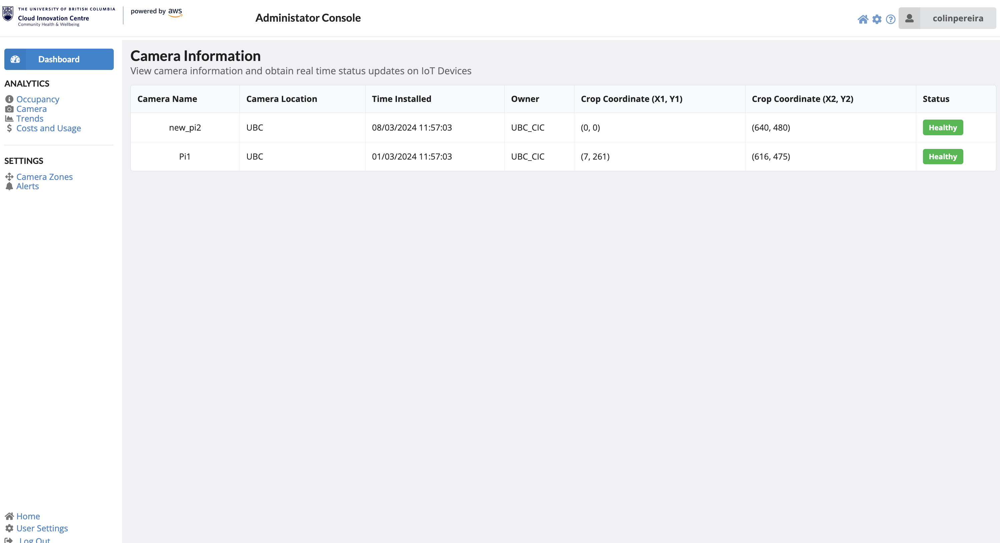

To understand the status displayed, you may hover over the status.

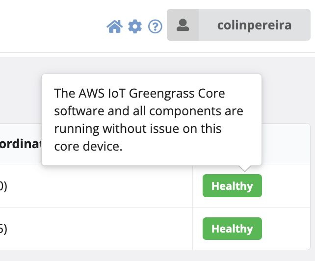

### Update camera zone settings

Navigate to the camara zone page and click update for the camera need to be updated.
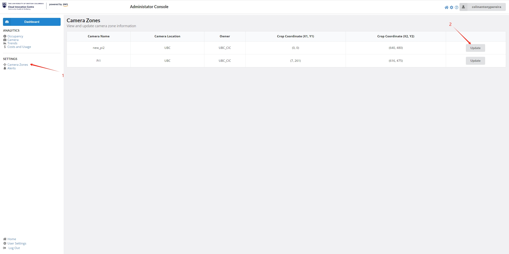
Here we show a sample image. You can drag the corner of the cropping box for desired zone for people counting. Don't forget to click submit after that. This might take a few seconds to update to the IoT device.
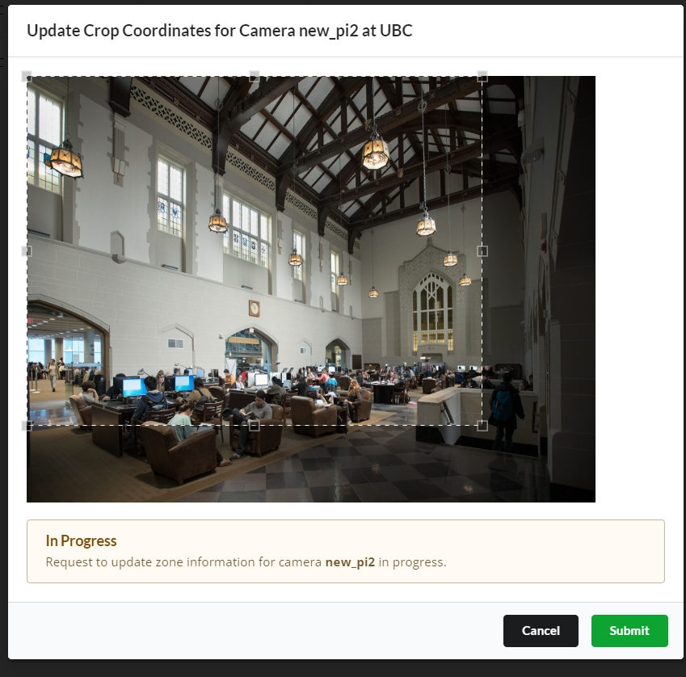

## Costs and Usage Page

You can also view AWS cloud usage costs from the costs page.

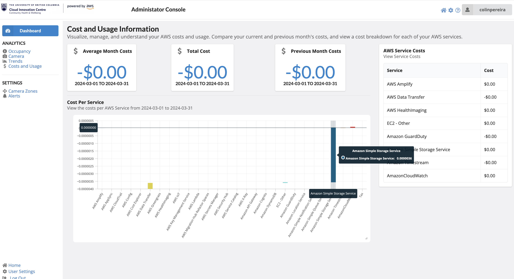

## Alerts Page

Administrators can configure maximum room occupancy levels for each camera zone from this page. The number used here is to calculate the remaining occupancy on the analytics page, shown above.

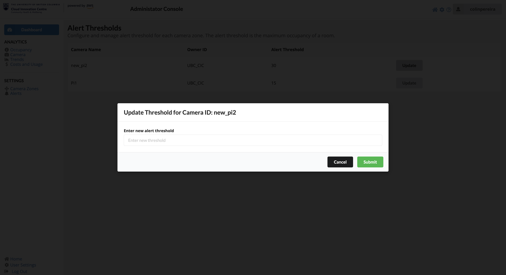
